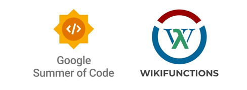

# Google Summer of Code 2023 - Report
Hello there👋, I am [Nikhil Mahajan](https://github.com/nik-55), a passionate software engineer and open-source enthusiast from India. This is my submission report for GSoC 2023 at the [Wikimedia Foundation](https://wikimediafoundation.org/). You can find the relevant links below.
- [Primary task](https://phabricator.wikimedia.org/T328587)
- [Accepted Proposal](https://phabricator.wikimedia.org/T333498)
- Project - [Wikifunctions](https://www.wikifunctions.org/wiki/Wikifunctions:Main_Page)
- Mentors - [Stef](https://www.mediawiki.org/wiki/User:SDunlap-WMF) and [James](https://www.mediawiki.org/wiki/User:Jdforrester_(WMF))
- [**Final Product**](https://gerrit.wikimedia.org/r/plugins/gitiles/mediawiki/extensions/WikiLambda/+/e5c08afbf4b807cfb355fe567318599c3c630abe/tests/selenium/) - I have contributed 90% to the code

## Summary of the goals
I have developed the tests that replicate important user journeys within the Wikifunctions platform. These tests play a crucial role in ensuring that modifications to the code (patches) don't cause any disruptions in how users interact with the application. These tests run every time a patch is being reviewed. The primary aim is to prevent the incorporation of patches that accidentally introduce bugs into the application. These tests fail if a patch creates problems for any of the user journeys. Moreover, these tests aid in identifying and fixing issues effectively.

## Overview of my contributions
The patches are listed in chronological order, with the latest contributions being first in the sequence.

- `docs`: [Update Readme for selenium tests](https://gerrit.wikimedia.org/r/c/mediawiki/extensions/WikiLambda/+/947405)
- `refactor`: [Refactor function test](https://gerrit.wikimedia.org/r/c/mediawiki/extensions/WikiLambda/+/950462)
- `fix`: [Fix tests to adjust to auth changes](https://gerrit.wikimedia.org/r/c/mediawiki/extensions/WikiLambda/+/945016)
- `fix`: [Update the selectors for publish component](https://gerrit.wikimedia.org/r/c/mediawiki/extensions/WikiLambda/+/941049)
- `fix`: [Fix tests](https://gerrit.wikimedia.org/r/c/mediawiki/extensions/WikiLambda/+/939280)
- `fix`: [Fix e2e tests](https://gerrit.wikimedia.org/r/c/mediawiki/extensions/WikiLambda/+/935878)
- `feature`: [Add command to run specs file multiple times](https://gerrit.wikimedia.org/r/c/mediawiki/extensions/WikiLambda/+/934455)
- `feature`: [Add tests for user other than admin for "connect"](https://gerrit.wikimedia.org/r/c/mediawiki/extensions/WikiLambda/+/934447)
- `feature`: [Add tests for "Create a type" journey](https://gerrit.wikimedia.org/r/c/mediawiki/extensions/WikiLambda/+/927770)
- `fix`: [Fix implementation tests](https://gerrit.wikimedia.org/r/c/mediawiki/extensions/WikiLambda/+/930830)
- `feature`: [Add tests for "connect" journey](https://gerrit.wikimedia.org/r/c/mediawiki/extensions/WikiLambda/+/929760)
- `feature`: [Add tests for "Create implementation via code" journey](https://gerrit.wikimedia.org/r/c/mediawiki/extensions/WikiLambda/+/923582)
- `feature`: [Add tests for "Create implementation via composition" journey](https://gerrit.wikimedia.org/r/c/mediawiki/extensions/WikiLambda/+/930599)
- `fix`: [Update tests for "Evaluate a function" journey](https://gerrit.wikimedia.org/r/c/mediawiki/extensions/WikiLambda/+/926554)
- `refactor`: [Update directory structure for function tests](https://gerrit.wikimedia.org/r/c/mediawiki/extensions/WikiLambda/+/924141)
- `feature`: [Add tests for "Create a tester" journey](https://gerrit.wikimedia.org/r/c/mediawiki/extensions/WikiLambda/+/920343)

## Thanks to the Community

I want to say a **big thank you** to the **Wikimedia Community** 🌟. Participating in the GSoC has been an amazing experience where I've learned and grown a lot while working together with others. I feel really lucky to be part of this wonderful community. Right from the start, everyone was very friendly and welcoming. I'm happy that I could contribute to the Wikimedia mission. The things I've learned during this time will definitely help me in the future. I'm also looking forward to seeing what's next for [Abstract Wikipedia](https://en.wikipedia.org/wiki/Abstract_Wikipedia).   
  
To the [**aw-team**](https://www.mediawiki.org/wiki/Abstract_Wikipedia_team) and my mentors [**Stef**](https://www.mediawiki.org/wiki/User:SDunlap-WMF) and [**James**](https://www.mediawiki.org/wiki/User:Jdforrester_(WMF)) - Your patience, guidance, and support mean a lot to me. **Thank u so much!** 🙌
